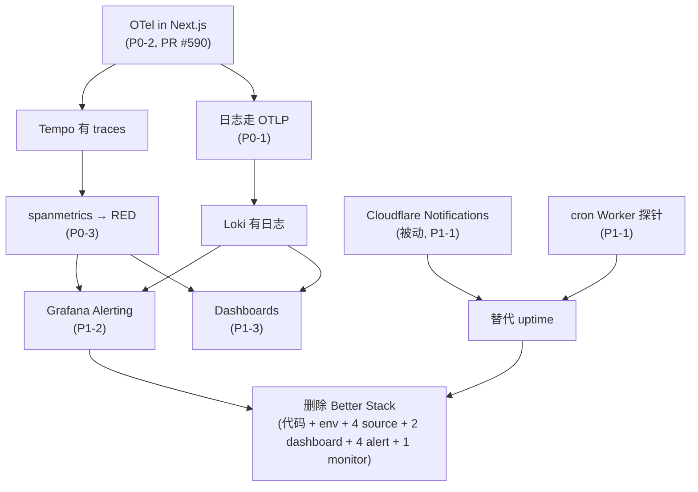

# Grafana Cloud 采用与迁移评审

Stack 已经授权可用（BRAWUKA-604），但**数据面是空的**。这份文档盘点现状、列出 Grafana Cloud 的能力清单，并给出从 Better Stack 迁移的优先级建议。

> **2026-09-21 修订（Owner 拍板，见 §6）**：不双跑、直接切、Better Stack 全退；能交给 Cloudflare 的交给 Cloudflare；日志不装 Alloy，走应用侧 OTLP；OTel 不采样。

## 0. 结论先行

1. **直接切，Better Stack 全退 —— 没有安全网可保。** 现在唯一的 uptime monitor 打的是 `coffeemood.com`：那是 GoDaddy 的停放页（NS `ns11.domaincontrol.com`，A `15.197.225.128`，永远 200），不是 CoffeeMode。真正的生产域名 `cafemood.app` 从 2026-09-18 起就是 502（BRAWUKA-500，prod web 零容器），这个 monitor 一次都没报过。4 条 chart alert 至今只被合成事件喂过。所谓「双写验证期」保护的是一个从未生效的告警面。
2. **一个组件，不是两个。** traces 和 logs 都从应用侧走 OTel → Grafana Cloud OTLP 网关。不装 Alloy：省一个容器、一次 Docker socket 挂载、一套独立凭据；而且 OTLP 原生带 `trace_id`，日志与 trace 自动关联，不需要在采集器里正则解析 JSON。**已落地（BRAWUKA-606 / BRAWUKA-607）**：`otlp-logs.ts` 直接走 OTLP 进 Loki，和 trace 共用同一个 SDK 与 endpoint。
3. **Cloudflare 优先。** 页面分析用 Cloudflare Web Analytics（**已经开着**）；uptime 用 Cloudflare 免费能力 + 一个 cron Worker 探针。Cloudflare 的主动 uptime 产品（Health Checks）免费档不支持，需要 Pro（§2.2）。
4. **不采样。** 量太小，head sampling 只会让 RED 计数失真（§3 P0-2）。
5. **免费档够用，但有两个硬约束**：14 天保留期，以及 10k active series。走 OTLP 后「Alloy 全量收 Docker stdout 会吃掉 logs 配额」这条约束自然消失：只有应用自己 `logError` / `logWarn` / access 行进 Loki，Next.js 的请求日志不进。

## 1. 现状盘点

### 1.1 Grafana Cloud 侧

| 项 | 值 |
|---|---|
| Stack | `lyuzizheng`，区域 `ap-southeast-1`（新加坡） |
| Grafana 版本 | v13.3.0 |
| 版本档位 | **Cloud Free** |
| MCP 身份 | `brabalawuka` / lvzizhengde@gmail.com，Main Org. Admin |
| 数据源 | 12 个，全部就绪 |
| **应用数据** | **无** |
| 告警规则 | 0 |
| CoffeeMode dashboard | 0 |

数据源清单：`grafanacloud-prom`（默认）、`-logs`、`-traces`、`-profiles`、`-k6`、`-infinity`、`-graphite`、`-alert-state-history`、`-cardinality-management`、`-knowledgegraph`、`-usage-insights`、`-usage`。

空栈的证据：Loki `label names` 返回 `[]`；Tempo 只有 intrinsic scope，没有任何 resource/span 属性；Prometheus 查不到任何非 `grafanacloud_*` 的 series；`/api/v1/provisioning/alert-rules` 返回 `[]`。

### 1.2 Better Stack 侧（当前唯一的可观测性）

| 类型 | 内容 |
|---|---|
| 日志 source | 4 个 CoffeeMode source：`coffeemode-rate-limit-staging` (2766431)、`coffeemode-rate-limit-prod` (2766432)、`coffeemode-api-errors-staging` (2769809)、`coffeemode-api-errors-prod` (2769810) |
| Dashboard | `CoffeeMode API Errors (staging)` (1131239)、`CoffeeMode API Errors (prod)` (1131240) |
| Chart alert | 4 条 enabled：`5xx sustained on a route` (2988583722/2988583724)、`Worker upstream_error spike` (2988583723/2988583725) |
| Uptime monitor | `coffeemood.com` (4941625) —— **打的是停放页，不是生产域名** |
| Heartbeat | 无 |
| Status page | 无 |

**两条独立的写入路径**，不是一条：

- `rate-limit-alert.ts` → `BETTER_STACK_INGEST_URL` / `_TOKEN` → `coffeemode-rate-limit-*`（限流命中）
- ~~`api-error-sink.ts` → `BETTER_STACK_ERRORS_INGEST_URL` / `_TOKEN` → `coffeemode-api-errors-*`（error / warn 行，spec 0011 D8 / BRAWUKA-541）~~ **已删除（BRAWUKA-607）**：error / warn / access 行改走 OTLP 进 Grafana Cloud Loki，`BETTER_STACK_ERRORS_INGEST_*` 两个变量一并移除。

**实际数据量**（2026-09-21 经 Better Stack query API 查，含冷存）：rate-limit staging 7 行（02:47–07:20）、rate-limit prod 0 行；api-errors staging 27 行（07:20–07:36）、api-errors prod 0 行。api-errors 那 27 行**全部是合成事件**（`route: "GET /api/__synthetic_alert"`），没有一条真实应用错误。

**告警面的真实状态**（2026-09-21 实测）：

- **uptime monitor 是假的。** `coffeemood.com` 解析到 GoDaddy 停放页（`15.197.225.128` / `3.33.251.168`，NS `ns11.domaincontrol.com`），返回 200 `CoffeeMood Cloud Space`。它监控的不是 CoffeeMode。同期 `https://cafemood.app`（含 `/`、`/api/health`、`/cafes`、`www`）**全部 502**，monitor 显示 🟢 Up。
- **4 条 chart alert 从未在真实流量上验证过。** 它们挂在 `coffeemode-api-errors-*` 上，而这两个 source 只被合成事件喂过；`docs/agent/pending-user-actions.md` §7 记录两条 ingest 路径的 Dokploy 环境变量仍待 Owner 粘贴。

结论：**当前不存在可用的告警面**，所以「先双写再拆」保护不了任何东西，直接切是正确做法。

### 1.3 应用侧

| 组件 | 现状 |
|---|---|
| `web/lib/observability/server-log.ts` | 输出单行 JSON（`{"type":"error","request_id":…}`）到 stdout。**没人收。** |
| `web/shared/log.ts` | 真正的实现（spec 0011 D6），带 `registerLineSink` 第二出口钩子；两个 Worker 也复用它 |
| `web/lib/observability/rate-limit-alert.ts` | 限流命中时 `console.warn`（10s 节流）+ fire-and-forget POST 到 Better Stack（**不**节流） |
| ~~`web/lib/observability/api-error-sink.ts`~~ | **已删除（BRAWUKA-607）**。error / warn / access 行现在由 `web/lib/observability/otlp-logs.ts` 走 OTLP 进 Grafana Cloud Loki，和 trace 同一个 SDK 与 endpoint。 |
| `web/proxy.ts` | Next.js 16 的 proxy（原 middleware）。**Next 16 里 proxy 默认跑 Node.js runtime**，所以它能用 Node 版 OTel SDK —— 这是「日志走 OTLP」可行的前提。 |
| `/api/health` | `{ok, version, boot_time}` |
| `/api/heartbeat` | 真实 DB round-trip（`select 1`），Better Stack 轮询它；同时是 Supabase 免费档项目的 keepalive（BRAWUKA-284） |
| `poi-service` / `image-service` | `console.error` + wrangler `[observability]`（数据留在 Cloudflare 侧） |
| `scripts/devops/smoke-test.sh` | 10 条部署后契约，bash + curl，手动跑 |
| OTel / Sentry / prom-client / Faro | **都没有**（OTel 在 PR #590 里，未合） |

## 2. 能力清单

### 2.1 Grafana Cloud

按账单维度整理（数据来自 stack 的 Billing/Usage dashboard 与 grafana.com/pricing）。

| 能力 | 计费维度 | 免费档额度 | 对 CoffeeMode 的价值 | 建议 |
|---|---|---|---|---|
| **Metrics** (Mimir) | billable series | 10k series / 14d | 高 —— RED、业务计数 | 做 |
| **Logs** (Loki) | GB ingested | 50 GB / 14d | 高 —— 应用已有 JSON 日志 | 做 |
| **Traces** (Tempo) | GB ingested | 50 GB / 14d | 高 —— 顺带产出 RED + service map | 做 |
| **Grafana Alerting** | 免费 | — | 高 —— 唯一的告警大脑 | 做 |
| **Dashboards** | 免费（1,000 上限） | — | 高 —— 替代 Better Stack dashboard | 做 |
| **Synthetic Monitoring** | test executions | 100k API + 10k browser / 月 | 中 —— uptime 的备选（§3 P1-1） | 备选 |
| **Frontend Observability** (Faro) | sessions | 50k sessions / 月 | 低 —— 页面分析已由 Cloudflare Web Analytics 覆盖 | 缓 |
| **Application Observability** | host hours | 2,232 host hours | 高 —— 随 traces 自动生效 | 做（被动） |
| **k6** | VUh | 500 VUh | 中 —— 发布前压测 | 做（小规模） |
| **IRM / OnCall** | active users | 3 users | 中 —— 现在只有一个人 | 缓 |
| **Database Observability** | host hours | 2,232 host hours | 中 —— PostGIS 慢查询 | 缓 |
| **Profiles** (Pyroscope) | GB ingested | 50 GB / 14d | 低 —— 没有明确的 CPU/内存问题 | 缓 |
| **Grafana Assistant** | tokens | 40M/用户 + 25M 系统池 | 中 —— MCP 已经在用 | 已可用 |
| **Kubernetes Monitoring** | host/container hours | 2,232 + 37,944 | 无 —— Dokploy 是单机 Docker | 不做 |
| **Adaptive Metrics / Traces** | 省成本 | — | 低 —— 量太小，省不出钱 | 不做 |
| **Knowledge Graph / Sift** | — | — | 低 —— 需要更多数据才有意义 | 不做 |

### 2.2 Cloudflare（2026-09-21 实测账号状态）

账号 `Lyuzizheng@gmail.com`，4 个 zone（`brabalawuka.cc`、`cafemood.app`、`cancan.money`、`gen-growth.com`）**全部是 Free Website**。

| 能力 | 免费档 | 现状 | 用途 |
|---|---|---|---|
| **Web Analytics (RUM)** | 免费，无站点数上限 | **已开**：`cafemood.app`，site_tag `0e7d27e20a594e80b00a7e4b0adea367`，`auto_install: true` | 页面分析 + Core Web Vitals（LCP/INP/CLS） |
| **Notifications → Passive Origin Monitoring** | 免费 | 未开 | 源站不可达（被动，靠真实流量触发） |
| **Notifications → Universal SSL** | 免费 | 未开 | 证书签发 / 续期 / 到期 |
| **Notifications → HTTP DDoS Attack** | 免费 | 未开 | L7 DDoS |
| **Notifications → Workers Observability** | 免费档有额度 | 未开 | 两个 Worker 的错误 |
| **Workers Cron Triggers** | 免费：5 个/账号，单点执行，15 min 上限 | 未用 | 主动 uptime 探针（§3 P1-1） |
| **Workers** | 免费：100k 请求/天 | `poi-service-*`、`image-service-*` 已部署 | — |
| **Cloudflare Access** | 免费 50 用户 | 已用于 `staging.cafemood.app` | — |
| **Turnstile** | 免费 | 待接（BRAWUKA-239） | — |
| **Health Checks** | **不支持**（0 个；Pro 10 个，$20/月） | 未开 | 主动 uptime —— 需要升级 |
| **DEX Synthetic Tests** | Zero Trust 付费 | — | 不做 |
| **Logpush** | 付费 / 企业 | — | 不做 |

**Notifications 在 Free 档只有邮件**：webhook 要 Pro，PagerDuty 要 Business，且只对 proxied 域名生效。所以主动探针的告警**不走** Cloudflare Notifications —— 探针直接把结果推给 Grafana，由 Grafana Alerting 统一报警，告警大脑只有一个。

**结论**：Cloudflare 免费档能覆盖**页面分析**（已开）和**被动可用性信号**，但**没有主动 uptime 产品**。要主动探测只有三条路：cron Worker 探针（免费）、Grafana Synthetic Monitoring（免费）、Cloudflare Health Checks（Pro，$20/月）。

### 2.3 免费档硬约束

- **14 天保留期**（metrics / logs / traces / profiles / k6）。Better Stack 现在是 3 天（logs），所以是改善，但别指望季度对比。
- **10k active series**。`traces_spanmetrics_*` 会按 route × status × service 展开，路由多的话要盯着。
- **3 个 Grafana 活跃用户**、**3 个 IRM 活跃用户**。
- **MCP 连接算 Assistant 活跃用户**，会消耗 40M token 配额。

### 2.4 接入端点（区域 ap-southeast-1）

| 信号 | 端点 | instance ID |
|---|---|---|
| Metrics (remote_write) | `https://prometheus-prod-37-prod-ap-southeast-1.grafana.net/api/prom/push` | 3599798 |
| Logs (Loki push) | `https://logs-prod-020.grafana.net/loki/api/v1/push` | 1795570 |
| Traces (Tempo) | `https://tempo-prod-14-prod-ap-southeast-1.grafana.net/tempo` | 1789871 |
| OTLP (all signals) | `https://otlp-gateway-prod-ap-southeast-1.grafana.net/otlp` | — |

四个端点都已探测：未认证请求返回 401，说明在线且只等凭据。

**OTLP 是唯一需要的端点。** SDK 会自己拼 `/v1/traces`、`/v1/logs`、`/v1/metrics`。

## 3. 迁移建议

### P0 — 让数据进来

#### P0-1 Logs：应用侧 OTLP → Loki（不装 Alloy）

> **已实现（BRAWUKA-607），但没走 Alloy。** 应用侧 `otlp-logs.ts` 直接 OTLP 进 Loki，理由见 §0 第 2 条。下面保留原 Alloy 方案备查；如果之后要收 Next.js 自身的请求日志（OTLP 覆盖不到），Alloy 仍然是那条路。

**为什么不用 Alloy**：Alloy 的唯一职责是「读 Docker stdout 再推走」。但应用已经有一个 OTel SDK（P0-2），把日志出口接在同一个 SDK 上，就少一个容器、少一次 Docker socket 挂载、少一套独立凭据，而且日志天然带 `trace_id` / `span_id`，在 Grafana 里能直接跳 trace —— 这是 stdout 采集做不到的。

**怎么做**：

- 在 `web/shared/log.ts` 已有的 `registerLineSink` 钩子上，把 `shipApiErrorLine`（Better Stack POST）换成 OTLP log emitter。注册点保持在 `web/lib/observability/server-log.ts`（web-only），两个 Worker 不受影响。
- `@opentelemetry/api-logs` + `@opentelemetry/sdk-logs` 的 `LoggerProvider` + `BatchLogRecordProcessor` + `OTLPExporter`，复用 P0-2 的 `OTEL_EXPORTER_OTLP_ENDPOINT` / `OTEL_EXPORTER_OTLP_HEADERS`。
- 字段映射：`type` → `severity_text`（error/warn），`route` / `request_id` / `code` / `status` → log record attributes，`error` → body。
- `web/proxy.ts` 的 access 行同样走这条路 —— Next.js 16 的 proxy 默认是 Node.js runtime，SDK 可用。

**Loki 侧的落法**（Loki 原生 OTLP 端点，不是 LokiExporter）：

- index label 只有预置的 resource attributes（默认 `service_name`、`service_namespace`）—— 天然低基数。
- `severity_text`、`route`、`request_id`、`code` 全部进 **structured metadata**，查询时 `| severity_text="ERROR"` 直接过滤，不需要 `| json` 解析。
- 免费档 5,000 active streams 上限因此不会成为问题。

**代价（明确接受）**：只收应用自己 emit 的行。Next.js 框架输出、启动日志、崩溃时的 stderr 留在 `docker logs` 里 —— ADR-0004 已经规定 stdout 是完整记录，`docker logs` 就是兜底。

**收益**：`server-log.ts` 的 error/warn 行、rate-limit 行、access 行全部可查，并且能和 traces 通过 `trace_id` / `request_id` 关联。

#### P0-2 Traces：Next.js 加 OpenTelemetry → Tempo

**为什么**：一次埋点换来四样东西 —— traces、service map、RED 指标、exemplar。不用手写 Prometheus 客户端。

**怎么做**（PR #590 已合；采样器已按 §6 决定 4 从两个 compose 文件移除）：

- `@vercel/otel` 的 `registerOTel` 挂在 `instrumentation.ts`，以 `OTEL_EXPORTER_OTLP_ENDPOINT` 是否存在为开关，本地与 CI 静默。
- `OTEL_EXPORTER_OTLP_ENDPOINT=https://otlp-gateway-prod-ap-southeast-1.grafana.net/otlp`，Basic auth = instance ID + token。
- `OTEL_RESOURCE_ATTRIBUTES=service.name=coffeemode-web,deployment.environment.name=staging|prod`。
- `http.route` 必须用**路由模板**（`/api/cafes/[id]`），否则 10k series 会爆；span name 也要带上模板，否则 spanmetrics 默认 label 里所有路由会塌成一条 `span_name="GET"` 序列。

**采样：不采样（100%）。**

「采样率」采的是 **trace（span）**，不是日志也不是指标。`parentbased_traceidratio` 是 head sampler：在根 span 上就决定整条 trace 记不记录，10% 意味着 10 条里 9 条在进程内就被丢掉。三个后果：

1. Tempo 里只有 10% 的 trace。
2. `traces_spanmetrics_*` 由 Tempo 的 metrics-generator 从**收到的** span 生成 —— 请求数和错误数都只有真实值的 ~10%，拿它做「5xx 率 > 1%」这类告警会直接算错（延迟分位数大致还准）。
3. 90% 的错误 trace 被丢掉，而那正是最想看的。

CoffeeMode 的量级离 50 GB/月差着几个数量级（粗估 10 万请求/月 × ~10 span × ~1 KB ≈ 1 GB/月），采样省不出任何东西，只会让 RED 计数失真。**所以起步就是 100%，不设采样器。** 将来量真的大了，正确做法是 tail sampling（保留全部错误 + 慢请求），而不是 head sampling —— 那需要采集器，届时再引入。

**收益**：Grafana Cloud 的 metrics-generator 会自动从 span 生成 `traces_spanmetrics_*`，RED 指标不用自己写。Tempo 数据源已经配好 `tracesToLogs` / `tracesToMetrics` / `serviceMap`，开箱即用。

**实现状态（BRAWUKA-606，2026-09-21）**：代码已落地 —— `web/lib/observability/otel.ts` 在 `instrumentation.ts` 里调 `registerOTel`，端点与 resource attributes 由 `deploy/dokploy/docker-compose.{staging,prod}.yml` 的 `environment:` 块钉死（非密钥），只有 `OTEL_EXPORTER_OTLP_HEADERS` 需要 Owner 粘贴（`docs/agent/pending-user-actions.md` §10）。`deployment.environment.name` 取 `staging` / `production`，与 `APP_ENV` 同一套词汇（BRAWUKA-607 从 `deployment.environment` 改名 —— 前者在 Grafana Cloud 的 Loki index-label 提升列表里，后者不在，改名后 env 成为流选择器）。**不设采样器**（§6 决定 4，2026-09-21 由 Owner 推翻原决定）。

**`http.route`：默认配置下 Next.js 自己会写，processor 只是兜底。** `base-server.js` 把 `next.route` 拷到 `http.route` 的前提是 `BaseServer.handleRequest` 是整条 trace 的根 span（它读 `tracer.getRootSpanAttributes()`，拿不到就 `return null` 并打一条 `Unexpected root span type` warn）。而 `NextServer.getRequestHandler` / `getServerRequestHandler` **不在** `NextVanillaSpanAllowlist`（`server/lib/trace/constants.js`），`tracer.trace()` 在 `!shouldTraceSpan` 时提前 return —— 默认配置下它根本不产生 span，于是 `BaseServer.handleRequest` 就是根 span，拷贝正常执行，span name 也会被改成 `GET /api/cafes/[id]`（RSC 请求带 `RSC ` 前缀）。本地 OTLP sink 实测确认：默认配置下 `GET /api/cafes/[id]` 是 ROOT span 且 `http.route` 已就位。

**拷贝被跳过只发生在非默认配置下**：`NEXT_OTEL_VERBOSE=1`，或 dev + `experimental.requestInsights`（`shouldTraceSpan = NextVanillaSpanAllowlist.has(type) || NEXT_OTEL_VERBOSE === '1'`）。此时请求处理链的 span 也被 trace，根 span 变成 `NextServer.getRequestHandler`，根检查失败，导出的 span 只剩 `http.target`（原始 path）、`http.route` 完全缺失。**注意：早期抓包时 `NEXT_OTEL_VERBOSE=1` 是开着的**，所以看到的是这个非默认形态 —— 结论一度被写成「Next.js 不会写」，是错的。

`otel.ts` 里的 `RouteTemplateSpanProcessor` 就是补这个缺口：从 `AppRouteRouteHandlers.runHandler` / `AppRender.getBodyResult` / `NextNodeServer.findPageComponents` 三个 span 上取 `next.route`（都是路由模板），在请求 span 结束时写回 `http.route`，并把 span name 改成 `GET /api/cafes/[id]`（`next.rsc` 为真时加 `RSC ` 前缀，与原生一致）。默认配置下它是 no-op —— `http.route === undefined` 守卫保证绝不覆盖原生值。**必须排除 `BaseServer.renderToResponse`** —— 它的 `next.route` 是 `ctx.pathname`，即原始 path，采进来就是 UUID 进 label，正是要避免的 cardinality 爆炸。span name 也要改：spanmetrics 的默认 label 只有 `service` / `span_name` / `span_kind` / `status_code`，`http.route` 不在其中，不改名的话所有 route 会塌成一条 `span_name="GET"` 序列。

**`routes` Map 的清理不能依赖「无 parent 的 span」。** `base-server.js` 用 `tracer.withPropagatedContext(req.headers, …)` 包住 `handleRequest`，客户端一旦带 `traceparent`，remote parent 会被采纳，整条 trace 里就没有任何 parentless span —— 靠它清理会每个带 traceparent 的请求漏一条 entry，prod 进程长驻即无界增长（Faro/RUM 接入后浏览器 fetch 全带 traceparent，触发面只会变大）。现在在请求 span 结束时直接删 entry，parentless 分支只作为「trace 里没有请求 span」的兜底。

已知噪音（非本次引入）：带 proxy 的请求会多出一条独立的 middleware trace —— 默认配置下是 1 个 `middleware GET` 根 span（无子 span），`NEXT_OTEL_VERBOSE=1` 下变成 3-span 的 stub（`NextServer.getRequestHandler` → `getServerRequestHandler` → `BaseServer.handleRequest`）。这是 Next.js 对 middleware 那一趟的埋点；`/api/health` 不在 proxy matcher 里，就没有这条。有界（多一条 `span_name="GET"` 序列），没动它。

#### P0-3 Metrics：先靠 spanmetrics，再补业务指标

不要急着上 `prom-client`。spanmetrics 已经给出每个 route 的 rate / error / duration。

需要额外补的（用 OTLP metrics 或 Alloy 的 `prometheus.exporter`）：

- Postgres 连接池（活跃 / 空闲 / 等待）。
- Cloudflare Worker 调用延迟与错误（从 Worker 侧推，或从 web 侧观测）。

**rate-limit 不做 counter，保留逐条日志并带关键 IP / 用户信息。** 429 命中是低频安全相关事件，`client_id` / `bucket` / `retry_after` 有排查价值，量也吃不垮 50 GB。做法：`emitRateLimitAlert` 每个事件走 `logWarn` 打一条**不节流**的 JSON，带 `client_id`（登录用户 `user:<id>`，匿名 `cf-connecting-ip` 的 SHA-256 前 32 位）、`bucket` / `retry_after` / `route`，**外加原始 `cf-connecting-ip`** —— 哈希值能看出「同一来源打了 500 次」但反查不回 IP，封不掉，排查滥用需要原始值。原始 IP 只进 structured metadata，不做 label。现有 10s 节流的 `console.warn` 保留只用于本地降噪。要计数时用 LogQL metric query 从日志派生，不需要应用侧埋点。

### P1 — 替代 Better Stack

#### P1-1 Uptime：Cloudflare 免费能力 + cron Worker 探针

**Cloudflare 免费档没有主动 uptime 产品**（Health Checks 是 Pro 专属，10 个 check，$20/月）。所以分两层：

**第一层（免费，立刻开）—— 被动信号**，在 Cloudflare Notifications 里打开：

- **Traffic Monitoring → Passive Origin Monitoring**：源站不可达时告警。
- **SSL/TLS → Universal SSL Alert**：证书签发 / 续期 / 到期。
- **DoS Protection → HTTP DDoS Attack Alert**。

**第二层（免费）—— 主动探针**：一个 cron Worker（`uptime-probe`），每 5 分钟：

- `GET https://cafemood.app/api/heartbeat`（真实 DB round-trip，同时是 Supabase 免费档项目的 keepalive，BRAWUKA-284）和 `GET /api/health`。
- 结果推给 Grafana Cloud（OTLP logs 或 Loki push），由 **Grafana Alerting** 报警 —— 告警大脑只有一个。
- 探针 UA 必须先加进 WAF 白名单（BRAWUKA-237 的规则现在只放行 Better Stack UA + `cafemood-smoke/1.0`，curl 默认 UA 在边缘就被 challenge）。

**已知限制（明确接受）**：cron trigger 在 Cloudflare 选定的**单个**机房执行，是单点视角 —— 它测的是「Cloudflare 边缘 → 源站」这条路径，不是「全球用户 → 站点」。够用来回答「站挂了吗」，不足以回答「某个地区是不是特别慢」。

**备选**：Grafana Synthetic Monitoring（免费 100k 次/月，多 region probe，自带 `probe_success` 和 TLS 到期检查，零代码）。如果之后需要多地域视角，再切过去；届时断言必须用 `expect()` / `fail()` 而不是裸 `check()`，否则 `probe_success` 不会失败，告警永远不响。

**不做**：升级 Cloudflare Pro 只为 Health Checks（$20/月买 10 个 check，而 Grafana SM 免费给多 region）。

#### P1-2 Grafana Alerting 替代 4 条 chart alert，并删除 Better Stack

**注意这 4 条 alert 依赖 `api-error-sink.ts` → `coffeemode-api-errors-*` 这条写入路径**（见 §1.2），和限流那条是分开的。~~所以「替代 chart alert」不只是重写 4 条规则，还要把这条 ingest 一起迁走 —— 否则拆掉 Better Stack 时，`api-error-sink.ts` 会变成往一个已停用 source 发数据的死代码。~~ **写入路径已迁走（BRAWUKA-607）**：`api-error-sink.ts` 删除，error / warn 行改走 OTLP 进 Loki，所以这 4 条 alert 现在没有数据源了 —— 替代它们的是 Grafana-managed alert rules（P0-4）。另外它们至今只被合成事件验证过，迁移前应该先在真实流量上确认一次。

**直接切，不双跑。** 顺序：

1. **先建 Grafana 告警规则**（数据源 Loki / spanmetrics），通知接 Slack 或邮件，notification policy 按 `env` label 分流，保留 `for:` 窗口避免抖动。规则可以先建好，等数据进来自然生效。
2. **再切应用**：删掉 `api-error-sink.ts` 和 `rate-limit-alert.ts` 里的 Better Stack POST，日志改走 OTLP（P0-1）。
3. **再删 Better Stack**：
   - 代码：`web/lib/observability/api-error-sink.ts` 整个删除；`rate-limit-alert.ts` 只留结构化日志。
   - Dokploy 两个 app 的 env：`BETTER_STACK_INGEST_URL` / `_TOKEN`、`BETTER_STACK_ERRORS_INGEST_URL` / `_TOKEN` 全部移除。
   - Better Stack 侧：4 个 source（2766431 / 2766432 / 2769809 / 2769810）、2 个 dashboard（1131239 / 1131240）、4 条 chart alert（2988583722–2988583725）、1 个 monitor（4941625）全部删除。
   - `docs/agent/pending-user-actions.md` §7 里那两条「待 Owner 粘贴 ingest 环境变量」的条目一并作废 —— 不用粘了。

**为什么可以直接切**：见 §1.2 —— 4 条 chart alert 从未在真实流量上验证过，uptime monitor 监控的是停放页。没有正在生效的告警面，就没有空窗风险。

#### P1-3 Dashboards 替代 2 个 Better Stack dashboard

目标：

- `CoffeeMode — API RED`：一个 dashboard，`env` 变量切换 staging/prod。
- `CoffeeMode — Rate limits`：命中分布、top bucket、top client。
- `CoffeeMode — Edge & Workers`：Cloudflare 侧的错误与延迟。

### P2 — 新增能力

| 项 | 理由 | 备注 |
|---|---|---|
| **k6** | 发布前压测 `/api/search` | 500 VUh 够 smoke + 小规模 load |
| **Database Observability** | PostGIS 空间查询慢的时候需要 `pg_stat_statements` | 需要 Supabase 侧开扩展 + 建监控用户 |
| **IRM / OnCall** | 3 个免费用户 | 现在一个人，Alerting + Slack 就够，等有轮值再上 |
| **Frontend Observability (Faro)** | 前端 JS 错误追踪 + session replay | 页面分析和 CWV 已由 Cloudflare Web Analytics 覆盖，只有需要错误追踪时才上 |

### 不建议现在做

- **Kubernetes Monitoring** —— 没有 K8s，Dokploy 是单机 Docker。硬套只会产生噪音。
- **Adaptive Metrics / Adaptive Traces** —— 量太小，省不出钱，反而多一层配置。
- **Profiles** —— 没有明确的 CPU / 内存问题要查。等有具体性能问题再开。
- **Knowledge Graph / Sift** —— 需要更多数据才有意义。
- **Cloudflare Health Checks** —— 需要 Pro（$20/月），免费档 0 个。

## 4. 迁移顺序

依赖关系：P0-1 和 P0-2 共用同一个 OTel SDK，可以一起做；P1-2 要等 P0 有数据；P1-1 独立，可以并行。

## 5. 风险与注意

1. **免费档配额**：50 GB logs / 50 GB traces / 10k series / 14 天保留。日志走 OTLP 后，量由应用 emit 决定（不含框架输出），比全量收 Docker stdout 更省。
2. **切到一半的窗口**：直接切的前提是 Grafana 告警规则**先**建好。顺序错了会出现「Better Stack 已删、Grafana 还没规则」的空窗。
3. **rate-limit 事件会丢**：`emitRateLimitAlert` 的 `console.warn` 是 10s 节流的，而 Better Stack POST 不节流。**已按 §6 决定 5 处理**：每个事件走 `logWarn` 打一条不节流的 JSON，10s 节流只留给本地降噪。
4. **标签基数**：Loki 只留低基数 label（OTLP 原生端点默认只把 `service_name` / `service_namespace` 做 index label，其余进 structured metadata）；Prometheus 不要用 `client_id`、`request_id`、`route` 做 label。spanmetrics 的 `http.route` 是例外，但**必须用路由模板**（`/api/cafes/[id]`）而不是原始 path。
5. **MCP 计费**：Grafana 把每个通过 MCP 连接的用户算作 Assistant 活跃用户，消耗 40M token 配额。
6. **cron Worker 是单点视角**：见 §3 P1-1。它不能替代多地域探测。
7. **`/api/heartbeat` 有双重职责**：除了 uptime 信号，它的真实 DB round-trip 是 Supabase 免费档项目的 keepalive（BRAWUKA-284）。探针必须继续打 `/api/heartbeat`（5 分钟间隔正好），不能只打 `/api/health`，否则项目会睡死。
8. **WAF 白名单**：BRAWUKA-237 的规则只放行 Better Stack UA + `cafemood-smoke/1.0`，curl 默认 UA 在边缘就被 challenge。cron Worker 探针上线前必须把它的 UA 加进白名单，否则 uptime 全是假阴性。
9. **`cafemood.app` 现在就是 502**（BRAWUKA-500，prod web 零容器）。uptime 探针上线后会立刻报警 —— 这是正确行为，不是误报。要么先修 BRAWUKA-500，要么接受探针一上线就红。

## 6. 已拍板的决定（Owner，2026-09-21）

1. **不双跑，直接切，Better Stack 全退。** 没有「双写验证期」。顺序是：Grafana 告警规则先建 → 应用切到 OTLP → 删 Better Stack 的代码、env、source、dashboard、alert、monitor。理由见 §1.2：现有告警面从未生效，没有安全网可保。**已执行（BRAWUKA-607 + BRAWUKA-605）**：`api-error-sink.ts` 与 `BETTER_STACK_ERRORS_INGEST_*` 已删除；rate-limit POST 与 `BETTER_STACK_INGEST_*` 也已删除。Better Stack 侧不再收到任何应用数据。
2. **能交给 Cloudflare 的交给 Cloudflare。** 页面分析用 Cloudflare Web Analytics（已开，免费，含 Core Web Vitals）；uptime 用 Cloudflare 免费通知 + 一个 cron Worker 探针。Cloudflare 免费档没有 Health Checks，不为它升级 Pro。
3. **日志不装 Alloy。** traces 和 logs 都从应用侧走 OTel → Grafana Cloud OTLP 网关，一个组件。代价是只收应用 emit 的行，框架输出留在 `docker logs`。
4. **OTel 不采样（100%）。** 采样只作用于 trace；head sampling 会让 spanmetrics 的 RED 计数失真，而我们的量级离配额差几个数量级。将来量大了用 tail sampling，不用 head sampling。原决定（prod 10% `parentbased_traceidratio`）保留备查：head sampling 在根 span 上丢整条 trace，而 `traces_spanmetrics_*` 是从实际到达的 span 派生的 —— 0.1 的比率会让每个 RED 计数只有真实值的十分之一，静默破坏 P0-3 依赖的告警。
5. **rate-limit 保留逐条日志，不做 counter，日志里带关键 IP / 用户信息。** 每个事件一条不节流的 JSON，带 `client_id`（登录用户是 `user:<id>`，匿名是 `cf-connecting-ip` 的 SHA-256 前 32 位）、`bucket` / `retry_after` / `route`，**外加原始 `cf-connecting-ip`**。理由：哈希过的 `client_id` 能看出「同一个来源打了 500 次」，但反查不回 IP，也就封不掉 —— 排查滥用需要原始值。原始 IP 只进 structured metadata，不做 label，随 14 天保留期过期。要计数时用 LogQL metric query 从日志派生。
