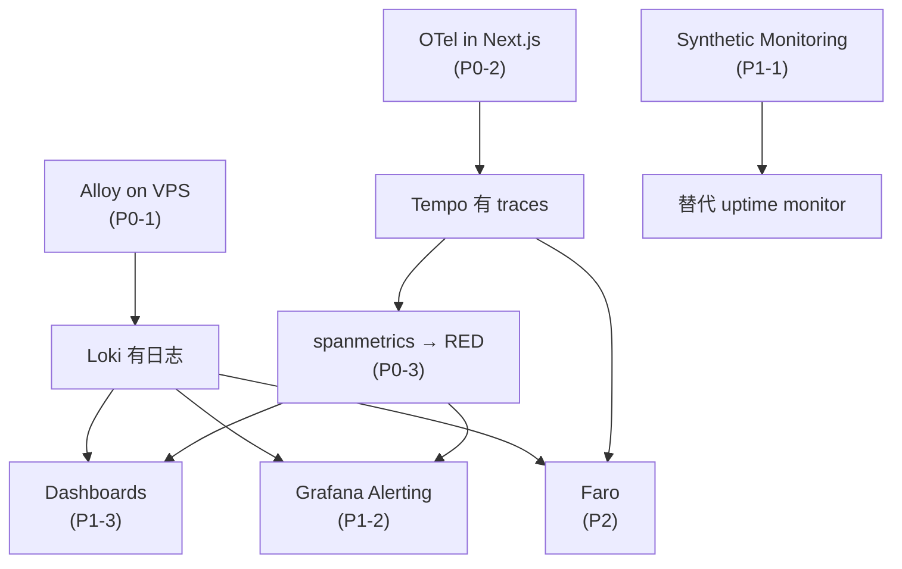

# Grafana Cloud 采用与迁移评审

Stack 已经授权可用（BRAWUKA-604），但**数据面是空的**。这份文档盘点现状、列出 Grafana Cloud 的能力清单，并给出从 Better Stack 迁移的优先级建议。

## 0. 结论先行

1. **最高杠杆的一步是在 VPS 上跑 Alloy。** 应用已经在往 stdout 打单行 JSON（`web/lib/observability/server-log.ts`），但没有任何东西收它 —— 日志只活在容器里，`docker logs` 之后就没了。零代码改动就能接进 Loki。
2. **第二高杠杆是给 Next.js 加 OpenTelemetry。** 一次埋点同时换来 traces、service map、RED 指标（`traces_spanmetrics_*` 由 metrics-generator 自动生成）和 exemplar。不用手写 Prometheus 客户端。
3. **Better Stack 不要一次性切掉。** 现在 4 条 chart alert + 1 个 uptime monitor 是唯一的告警面，先双写、验证、再拆。但只有 uptime monitor 是真在跑的 —— 4 条 chart alert 至今只被合成事件喂过，两条 ingest 路径的环境变量仍待粘贴（§1.2）。
4. **免费档够用，但有两个硬约束**：14 天保留期，以及 10k active series。Alloy 全量收 Docker stdout 会吃掉 logs 配额，要先做过滤。

## 1. 现状盘点

### 1.1 Grafana Cloud 侧

| 项 | 值 |
|---|---|
| Stack | `lyuzizheng`，区域 `ap-southeast-1`（新加坡） |
| Grafana 版本 | v13.3.0 |
| 版本档位 | **Cloud Free** |
| MCP 身份 | `brabalawuka` / lvzizhengde@gmail.com，Main Org. Admin |
| 数据源 | 12 个，全部就绪 |
| **应用数据** | **无** |
| 告警规则 | 0 |
| CoffeeMode dashboard | 0 |

数据源清单：`grafanacloud-prom`（默认）、`-logs`、`-traces`、`-profiles`、`-k6`、`-infinity`、`-graphite`、`-alert-state-history`、`-cardinality-management`、`-knowledgegraph`、`-usage-insights`、`-usage`。

空栈的证据：Loki `label names` 返回 `[]`；Tempo 只有 intrinsic scope，没有任何 resource/span 属性；Prometheus 查不到任何非 `grafanacloud_*` 的 series；`/api/v1/provisioning/alert-rules` 返回 `[]`。

### 1.2 Better Stack 侧（当前唯一的可观测性）

| 类型 | 内容 |
|---|---|
| 日志 source | 4 个 CoffeeMode source：`coffeemode-rate-limit-staging` (2766431)、`coffeemode-rate-limit-prod` (2766432)、`coffeemode-api-errors-staging` (2769809)、`coffeemode-api-errors-prod` (2769810) |
| Dashboard | `CoffeeMode API Errors (staging)` (1131239)、`CoffeeMode API Errors (prod)` (1131240) |
| Chart alert | 4 条 enabled：`5xx sustained on a route`、`Worker upstream_error spike`（staging / prod 各一套） |
| Uptime monitor | `coffeemood.com`（status 类型） |
| Heartbeat | 无 |
| Status page | 无 |

**两条独立的写入路径**，不是一条：

- `rate-limit-alert.ts` → `BETTER_STACK_INGEST_URL` / `_TOKEN` → `coffeemode-rate-limit-*`（限流命中）
- `api-error-sink.ts` → `BETTER_STACK_ERRORS_INGEST_URL` / `_TOKEN` → `coffeemode-api-errors-*`（error / warn 行，spec 0011 D8 / BRAWUKA-541）

**实际数据量**（2026-09-21 经 Better Stack query API 查，含冷存）：rate-limit staging 7 行（02:47–07:20）、rate-limit prod 0 行；api-errors staging 27 行（07:20–07:36）、api-errors prod 0 行。api-errors 那 27 行**全部是合成事件**（`route: "GET /api/__synthetic_alert"`），没有一条真实应用错误。

**告警面的真实状态**：4 条 chart alert 挂在 `coffeemode-api-errors-*` 上，而这两个 source 只被合成事件喂过；`docs/agent/pending-user-actions.md` §7 记录两条 ingest 路径的 Dokploy 环境变量仍待 Owner 粘贴。所以**目前唯一被证明可用的告警是 uptime monitor**，4 条 chart alert 尚未在真实流量上验证过 —— 迁移时不能把它们当成现成的安全网。

### 1.3 应用侧

| 组件 | 现状 |
|---|---|
| `web/lib/observability/server-log.ts` | 输出单行 JSON（`{"type":"error","request_id":…}`）到 stdout。**没人收。** |
| `web/lib/observability/rate-limit-alert.ts` | 限流命中时 `console.warn`（10s 节流）+ fire-and-forget POST 到 Better Stack（**不**节流） |
| `web/lib/observability/api-error-sink.ts` | error / warn 行 fire-and-forget POST 到 `coffeemode-api-errors-*`（`keepalive`，不阻塞、不抛错，未配置时 no-op）。**第二条 Better Stack 出口**，喂 4 条 chart alert。 |
| `/api/health` | `{ok, version, boot_time}` |
| `/api/heartbeat` | 真实 DB round-trip，Better Stack 轮询它 |
| `poi-service` / `image-service` | `console.error` + wrangler `[observability]`（数据留在 Cloudflare 侧） |
| `scripts/devops/smoke-test.sh` | 10 条部署后契约，bash + curl，手动跑 |
| OTel / Sentry / prom-client / Faro | **都没有** |

## 2. Grafana Cloud 能力清单

按账单维度整理（数据来自 stack 的 Billing/Usage dashboard 与 grafana.com/pricing）。

| 能力 | 计费维度 | 免费档额度 | 对 CoffeeMode 的价值 | 建议 |
|---|---|---|---|---|
| **Metrics** (Mimir) | billable series | 10k series / 14d | 高 —— RED、业务计数 | 做 |
| **Logs** (Loki) | GB ingested | 50 GB / 14d | 高 —— 应用已有 JSON 日志 | 做 |
| **Traces** (Tempo) | GB ingested | 50 GB / 14d | 高 —— 顺带产出 RED + service map | 做 |
| **Synthetic Monitoring** | test executions | 100k API + 10k browser / 月 | 高 —— 替代 uptime monitor | 做 |
| **Frontend Observability** (Faro) | sessions | 50k sessions / 月 | 高 —— CWV、JS 错误、session replay | 做 |
| **Application Observability** | host hours | 2,232 host hours | 高 —— 随 traces 自动生效 | 做（被动） |
| **Grafana Alerting** | 免费 | — | 高 —— 替代 chart alerts | 做 |
| **Dashboards** | 免费（1,000 上限） | — | 高 —— 替代 Better Stack dashboard | 做 |
| **k6** | VUh | 500 VUh | 中 —— 发布前压测 | 做（小规模） |
| **IRM / OnCall** | active users | 3 users | 中 —— 现在只有一个人 | 缓 |
| **Database Observability** | host hours | 2,232 host hours | 中 —— PostGIS 慢查询 | 缓 |
| **Profiles** (Pyroscope) | GB ingested | 50 GB / 14d | 低 —— 没有明确的 CPU/内存问题 | 缓 |
| **Grafana Assistant** | tokens | 40M/用户 + 25M 系统池 | 中 —— MCP 已经在用 | 已可用 |
| **Kubernetes Monitoring** | host/container hours | 2,232 + 37,944 | 无 —— Dokploy 是单机 Docker | 不做 |
| **Adaptive Metrics / Traces** | 省成本 | — | 低 —— 量太小，省不出钱 | 不做 |
| **Knowledge Graph / Sift** | — | — | 低 —— 需要更多数据才有意义 | 不做 |

### 免费档硬约束

- **14 天保留期**（metrics / logs / traces / profiles / k6）。Better Stack 现在是 3 天（logs），所以是改善，但别指望季度对比。
- **10k active series**。`traces_spanmetrics_*` 会按 route × status × service 展开，路由多的话要盯着。
- **3 个 Grafana 活跃用户**、**3 个 IRM 活跃用户**。
- **MCP 连接算 Assistant 活跃用户**，会消耗 40M token 配额。

### 接入端点（区域 ap-southeast-1）

| 信号 | 端点 | instance ID |
|---|---|---|
| Metrics (remote_write) | `https://prometheus-prod-37-prod-ap-southeast-1.grafana.net/api/prom/push` | 3599798 |
| Logs (Loki push) | `https://logs-prod-020.grafana.net/loki/api/v1/push` | 1795570 |
| Traces (Tempo) | `https://tempo-prod-14-prod-ap-southeast-1.grafana.net/tempo` | 1789871 |
| OTLP (all signals) | `https://otlp-gateway-prod-ap-southeast-1.grafana.net/otlp` | — |

四个端点都已探测：未认证请求返回 401，说明在线且只等凭据。

## 3. 迁移建议

### P0 — 让数据进来

#### P0-1 Logs：VPS 上跑 Alloy → Loki

**为什么**：应用已经在打 JSON 行，只差一个采集器。这是投入产出比最高的一步。

**怎么做**：Dokploy 加一个 Alloy 容器（compose，`grafana/alloy` 镜像），配置：

- `discovery.docker` 发现容器，`loki.source.docker` 读 stdout。
- `loki.process` 解析 JSON，把 `level`、`route`、`request_id`、`type` 提出来。
- `loki.write` 推到 `https://logs-prod-020.grafana.net/loki/api/v1/push`，Basic auth = instance ID + API token。

**标签纪律**（免费档 5,000 active streams 上限）：

- label 只留 `env`、`service`、`container`、`level`。
- `request_id`、`route`、`client_id` 一律进 structured metadata，**不能**做 label —— 否则 stream 数爆炸。

**先过滤再发**：Next.js 的请求日志量最大，先只收 `web` 容器 + `level != "debug"`，观察一周配额再放开。

**收益**：`server-log.ts` 的 error/warn 行、rate-limit 行、Next.js 请求日志全部可查，并且能和 traces 通过 `request_id` / `trace_id` 关联。

#### P0-2 Traces：Next.js 加 OpenTelemetry → Tempo

**为什么**：一次埋点换来四样东西 —— traces、service map、RED 指标、exemplar。不用手写 Prometheus 客户端。

**怎么做**：

- Next.js 用 `@vercel/otel`（官方推荐，和 App Router 兼容）或 `@opentelemetry/sdk-node` + `instrumentation.ts`。
- `OTEL_EXPORTER_OTLP_ENDPOINT=https://otlp-gateway-prod-ap-southeast-1.grafana.net/otlp`，Basic auth = instance ID + token。
- `OTEL_RESOURCE_ATTRIBUTES=service.name=coffeemode-web,deployment.environment=staging|prod`。

**采样**：~~先用 `parentbased_traceidratio` 10% 起步，看一周实际用量再调~~ —— **已推翻，不采样、100% 全采**（§6 决定 3）。免费档 50 GB，CoffeeMode 的量级远低于它。

**收益**：Grafana Cloud 的 metrics-generator 会自动从 span 生成 `traces_spanmetrics_*`，RED 指标不用自己写。Tempo 数据源已经配好 `tracesToLogs` / `tracesToMetrics` / `serviceMap`，开箱即用。

**实现状态（BRAWUKA-606，2026-09-21）**：代码已落地 —— `web/lib/observability/otel.ts` 在 `instrumentation.ts` 里调 `registerOTel`，端点与 resource attributes 由 `deploy/dokploy/docker-compose.{staging,prod}.yml` 的 `environment:` 块钉死（非密钥），只有 `OTEL_EXPORTER_OTLP_HEADERS` 需要 Owner 粘贴（`docs/agent/pending-user-actions.md` §10）。`deployment.environment` 取 `staging` / `production`，与 `APP_ENV` 同一套词汇。**不设采样器**（§6 决定 3，2026-09-21 由 Owner 推翻原决定）。

**`http.route`：默认配置下 Next.js 自己会写，processor 只是兜底。** `base-server.js` 把 `next.route` 拷到 `http.route` 的前提是 `BaseServer.handleRequest` 是整条 trace 的根 span（它读 `tracer.getRootSpanAttributes()`，拿不到就 `return null` 并打一条 `Unexpected root span type` warn）。而 `NextServer.getRequestHandler` / `getServerRequestHandler` **不在** `NextVanillaSpanAllowlist`（`server/lib/trace/constants.js`），`tracer.trace()` 在 `!shouldTraceSpan` 时提前 return —— 默认配置下它根本不产生 span，于是 `BaseServer.handleRequest` 就是根 span，拷贝正常执行，span name 也会被改成 `GET /api/cafes/[id]`（RSC 请求带 `RSC ` 前缀）。本地 OTLP sink 实测确认：默认配置下 `GET /api/cafes/[id]` 是 ROOT span 且 `http.route` 已就位。

**拷贝被跳过只发生在非默认配置下**：`NEXT_OTEL_VERBOSE=1`，或 dev + `experimental.requestInsights`（`shouldTraceSpan = NextVanillaSpanAllowlist.has(type) || NEXT_OTEL_VERBOSE === '1'`）。此时请求处理链的 span 也被 trace，根 span 变成 `NextServer.getRequestHandler`，根检查失败，导出的 span 只剩 `http.target`（原始 path）、`http.route` 完全缺失。**注意：早期抓包时 `NEXT_OTEL_VERBOSE=1` 是开着的**，所以看到的是这个非默认形态 —— 结论一度被写成「Next.js 不会写」，是错的。

`otel.ts` 里的 `RouteTemplateSpanProcessor` 就是补这个缺口：从 `AppRouteRouteHandlers.runHandler` / `AppRender.getBodyResult` / `NextNodeServer.findPageComponents` 三个 span 上取 `next.route`（都是路由模板），在请求 span 结束时写回 `http.route`，并把 span name 改成 `GET /api/cafes/[id]`（`next.rsc` 为真时加 `RSC ` 前缀，与原生一致）。默认配置下它是 no-op —— `http.route === undefined` 守卫保证绝不覆盖原生值。**必须排除 `BaseServer.renderToResponse`** —— 它的 `next.route` 是 `ctx.pathname`，即原始 path，采进来就是 UUID 进 label，正是要避免的 cardinality 爆炸。span name 也要改：spanmetrics 的默认 label 只有 `service` / `span_name` / `span_kind` / `status_code`，`http.route` 不在其中，不改名的话所有 route 会塌成一条 `span_name="GET"` 序列。

**`routes` Map 的清理不能依赖「无 parent 的 span」。** `base-server.js` 用 `tracer.withPropagatedContext(req.headers, …)` 包住 `handleRequest`，客户端一旦带 `traceparent`，remote parent 会被采纳，整条 trace 里就没有任何 parentless span —— 靠它清理会每个带 traceparent 的请求漏一条 entry，prod 进程长驻即无界增长（Faro/RUM 接入后浏览器 fetch 全带 traceparent，触发面只会变大）。现在在请求 span 结束时直接删 entry，parentless 分支只作为「trace 里没有请求 span」的兜底。

已知噪音（非本次引入）：带 proxy 的请求会多出一条独立的 middleware trace —— 默认配置下是 1 个 `middleware GET` 根 span（无子 span），`NEXT_OTEL_VERBOSE=1` 下变成 3-span 的 stub（`NextServer.getRequestHandler` → `getServerRequestHandler` → `BaseServer.handleRequest`）。这是 Next.js 对 middleware 那一趟的埋点；`/api/health` 不在 proxy matcher 里，就没有这条。有界（多一条 `span_name="GET"` 序列），没动它。

#### P0-3 Metrics：先靠 spanmetrics，再补业务指标

不要急着上 `prom-client`。spanmetrics 已经给出每个 route 的 rate / error / duration。

需要额外补的（用 OTLP metrics 或 Alloy 的 `prometheus.exporter`）：

- rate-limit 命中计数（counter，按 `bucket` 分）。
- Postgres 连接池（活跃 / 空闲 / 等待）。
- Cloudflare Worker 调用延迟与错误（从 Worker 侧推，或从 web 侧观测）。

### P1 — 替代 Better Stack

#### P1-1 Synthetic Monitoring 替代 uptime monitor

现在只有 Better Stack 一个 `coffeemood.com` status monitor。

目标：

- HTTP check 覆盖 `/api/health`、`/api/heartbeat`、`/`，从多个 probe region 跑（新加坡 + 就近区域）。
- 一个 scripted check 覆盖搜索主流程 —— 把 `scripts/devops/smoke-test.sh` 的 10 条契约里挑核心几条改写成 k6。
- 断言必须让 `probe_success` **真的失败**：用 `expect()` / `fail()`，不是裸 `check()`。裸 `check()` 只记结果不改 `probe_success`，告警永远不响。
- 附带收益：TLS 证书到期告警。

配额估算：3 个 HTTP check × 3 region × 1 分钟间隔 ≈ 3 × 3 × 43,200 = 388,800 次/月，**超免费档 100k**。降到 5 分钟间隔 ≈ 77,760 次/月，留出余量。

两个上线前必须处理的约束（见 §5 风险 7、8）：

- **必须继续打 `/api/heartbeat`**，不能只打 `/api/health` —— 它的 DB round-trip 是 Supabase 免费档 staging 项目的 keepalive（BRAWUKA-284）。5 分钟间隔正好。
- **probe 的 UA / IP 段要先加进 WAF 白名单**（BRAWUKA-237），否则 curl 默认 UA 在边缘就被 challenge，uptime 全是假阴性。

#### P1-2 Grafana Alerting 替代 4 条 chart alert

现在 Better Stack 有 `5xx sustained on a route` 和 `Worker upstream_error spike`，staging / prod 各一套。

**注意这 4 条 alert 依赖 `api-error-sink.ts` → `coffeemode-api-errors-*` 这条写入路径**（见 §1.2），和限流那条是分开的。所以「替代 chart alert」不只是重写 4 条规则，还要把这条 ingest 一起迁走 —— 否则拆掉 Better Stack 时，`api-error-sink.ts` 会变成往一个已停用 source 发数据的死代码。另外它们至今只被合成事件验证过，迁移前应该先在真实流量上确认一次。

目标：Grafana-managed alert rules，数据源用 Loki（日志派生）或 spanmetrics（trace 派生）。

- 通知先接 Slack / 邮件 contact point。
- notification policy 按 `env` label 分流，staging 低优先级。
- 保留 `for:` 窗口避免抖动。

#### P1-3 Dashboards 替代 2 个 Better Stack dashboard

现在有 `CoffeeMode API Errors (staging/prod)` 两个。

目标：

- `CoffeeMode — API RED`：一个 dashboard，`env` 变量切换 staging/prod。
- `CoffeeMode — Rate limits`：命中分布、top bucket、top client。
- `CoffeeMode — Edge & Workers`：Cloudflare 侧的错误与延迟。

### P2 — 新增能力

| 项 | 理由 | 备注 |
|---|---|---|
| **Frontend Observability (Faro)** | 地图页 LCP 是真实风险点；现在对真实用户的前端体验零可见性 | 50k sessions/月，够早期 |
| **k6** | 发布前压测 `/api/search` | 500 VUh 够 smoke + 小规模 load |
| **Database Observability** | PostGIS 空间查询慢的时候需要 `pg_stat_statements` | 需要 Supabase 侧开扩展 + 建监控用户 |
| **IRM / OnCall** | 3 个免费用户 | 现在一个人，Alerting + Slack 就够，等有轮值再上 |

### 不建议现在做

- **Kubernetes Monitoring** —— 没有 K8s，Dokploy 是单机 Docker。硬套只会产生噪音。
- **Adaptive Metrics / Adaptive Traces** —— 量太小，省不出钱，反而多一层配置。
- **Profiles** —— 没有明确的 CPU / 内存问题要查。等有具体性能问题再开。
- **Knowledge Graph / Sift** —— 需要更多数据才有意义。

## 4. 迁移顺序

依赖关系：P1-2 和 P1-3 都要等 P0 有数据；P1-1 独立，可以并行。

## 5. 风险与注意

1. **免费档配额**：50 GB logs / 50 GB traces / 10k series / 14 天保留。Alloy 全量收 Docker stdout 会吃掉 logs 配额 —— 先只收 `web` 容器并丢 debug。
2. **双写期**：Better Stack 保留到 Grafana 侧验证通过再拆。不要一次性切换，否则告警面出现空窗。但「现成的告警面」比看上去薄：4 条 chart alert 只被合成事件喂过，两条 ingest 路径的 Dokploy 环境变量仍待粘贴（§1.2），真正在跑的只有 uptime monitor。双写期的对照基线应该是 uptime monitor，不是那 4 条 alert。
3. **rate-limit 事件会丢**：`emitRateLimitAlert` 的 `console.warn` 是 10s 节流的，而 Better Stack POST 不节流。如果改成「靠 Alloy 收 stdout」，节流会让事件数明显变少。**已按 §6 决定 4 处理**：每个事件走 `logWarn` 打一条不节流的 JSON，10s 节流只留给本地降噪。
4. **标签基数**：Loki 只留低基数 label；Prometheus 不要用 `client_id`、`request_id`、`route` 做 label。spanmetrics 的 `http.route` 是例外，但**必须用路由模板**（`/api/cafes/[id]`）而不是原始 path，否则 10k series 会爆 —— `@vercel/otel` 默认用模板，Next.js 16 + `instrumentation.ts` 的边界情况（edge runtime、Turbopack）要在实现 issue 里验证。
5. **MCP 计费**：Grafana 把每个通过 MCP 连接的用户算作 Assistant 活跃用户，消耗 40M token 配额。
6. **Synthetic 配额**：3 个 check × 3 region × 1 分钟 = 388k 次/月，超免费档。间隔要放宽到 5 分钟。
7. **`/api/heartbeat` 有双重职责**：除了 uptime 信号，它的真实 DB round-trip 是 Supabase 免费档 staging 项目的 keepalive（BRAWUKA-284）。Synthetic check 必须继续打 `/api/heartbeat`（5 分钟间隔正好），不能只打 `/api/health`，否则 staging 项目会睡死。
8. **WAF 白名单**：BRAWUKA-237 的规则只放行 Better Stack UA + `cafemood-smoke/1.0`，curl 默认 UA 在边缘就被 challenge。Grafana SM probes 上线前必须把 probe UA / IP 段加进白名单，否则 uptime 全是假阴性。

## 6. 已拍板的决定（Reviewer & Architect，2026-09-21）

1. **日志：不切，双跑到 P1 验证完。** stdout 是唯一完整记录（ADR-0004），Alloy 收它不影响 Better Stack sink。`api-error-sink.ts` 和 rate-limit POST 保持开启；Grafana Alerting 验证通过后删 sink + env vars（`BETTER_STACK_*_INGEST_*`），不是改 Alloy 配置。
2. **Better Stack：全退，但分两步。** P1-1 synthetic 验证通过前保留 uptime monitor，之后全退。没有要重建的 status page / heartbeat（Better Stack 侧本来就没有）。
3. ~~**OTel 采样：prod 10% `parentbased_traceidratio` 起步，staging 100%。**~~ **已由 Owner 于 2026-09-21 推翻：不采样，100% 全采。** 理由：head sampling 在根 span 上丢整条 trace，而 `traces_spanmetrics_*` 是从实际到达的 span 派生的 —— 0.1 的比率会让每个 RED 计数只有真实值的十分之一，静默破坏 P0-3 依赖的告警。量级远低于 50 GB 免费档，采样省不下什么却牺牲正确性；真涨上来时解法是 tail sampling（保留全部错误 + 慢 trace），不是 head ratio。原决定保留备查：staging 量小，全采方便调试；prod 一周后看用量再调。接受的代价：head sampling 下 90% 的错误 trace 会丢，靠日志补 —— 这正是 P0-1 先做的理由。
4. **rate-limit：保留逐条事件，但改成结构化日志，不是 counter。** 429 命中是低频安全相关事件，`client_id` / `bucket` / `retry_after` 有排查价值，量也吃不垮 50 GB。做法：`emitRateLimitAlert` 里每个事件走 `logWarn` 打一条 JSON（`client_id` 进 structured metadata，不做 label），现有 10s 节流的 `console.warn` 保留只用于本地降噪。counter 可以之后用 spanmetrics 或 LogQL metric query 派生，不需要应用侧埋点。
